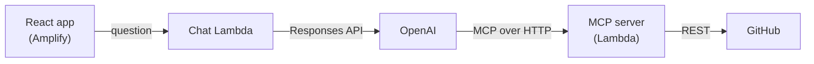

# DevContext

Ask a question about a GitHub repo and get an answer based on the actual code. You also see which files the model read to get there.

Try it: https://main.d3gcrotthe39k2.amplifyapp.com

## Why I built this

Everyone from the top companies gives students the same advice: contribute to open source. What nobody mentions is that the hardest part isn't writing the code, it's the week you spend before that just figuring out how the project is put together. Where does the entry point live? Which of these forty folders actually matters? Why are there three files called `utils`?

I ran into this myself over a summer contributing to [lsf](https://github.com/BCStudentSoftwareDevTeam/lsf), a Flask app with a few thousand commits. Most of my first weeks were spent asking "where does X live?" I wanted to build the tool I wished I'd had: something that answers that kind of question from the real repository instead of from memory.
## How it works



The MCP server exposes three tools: list the repo's files, read one file, search the code. It's a normal stdio MCP server; a small adapter runs it inside a Lambda function behind API Gateway, spawning the process per request.

The chat side is another Lambda that calls OpenAI's Responses API and hands it the MCP server's URL as a tool. OpenAI does the tool calling itself. I never see the intermediate steps, I just get back the answer plus a record of every tool call it made. Follow-up questions are chained with `previous_response_id`, so the model remembers what it already read.

The frontend shows that record under each answer. That's honestly my favorite part. You can watch the model list the tree, read three files, and then cite them. File paths in the answer link to the real file on GitHub.

## What's in here

```
mcp-server/   the MCP server and its Lambda wrapper
api-server/   the chat Lambda (plain fetch, no SDK)
frontend/     React + Vite
infra/        CDK stack that deploys the two Lambdas
```

## Running it yourself

You need Node 20+, an AWS account, a GitHub fine-grained token (public repos, read-only is enough), and an OpenAI key.

```bash
cd mcp-server && npm install
echo "GITHUB_TOKEN=..." > .env
npx @modelcontextprotocol/inspector node --env-file=.env server.js   # try the tools locally

cd ../api-server && npm install && echo "OPENAI_API_KEY=..." > .env
cd ../infra && npm install && npx cdk bootstrap && npx cdk deploy      # prints ChatUrl and McpUrl

cd ../frontend && npm install
echo "VITE_CHAT_URL=<ChatUrl>" > .env
npm run dev
```

The CDK app reads the two `.env` files when it synthesizes and sets them as Lambda environment variables, so nothing secret is ever in the repo.

## Important points

- Every tool returns errors as text with `isError: true` instead of throwing. When the model asks for a file that isn't there, it gets told so and tries something else, rather than the whole request falling over.

- Everything the model sees is capped: 1,500 files in a tree listing, 60k characters per file, 15 search hits. A big repo gets a truncated view instead of blowing up the context window.

- A question costs about a cent on `gpt-6-sol`. The AWS side is well within the free tier.

## Future Plans

- A `read_file_range` tool, so the model can read the middle of a big file instead of only the first 60k characters.
- Private repos, which would need a per-user token instead of my server-side one.